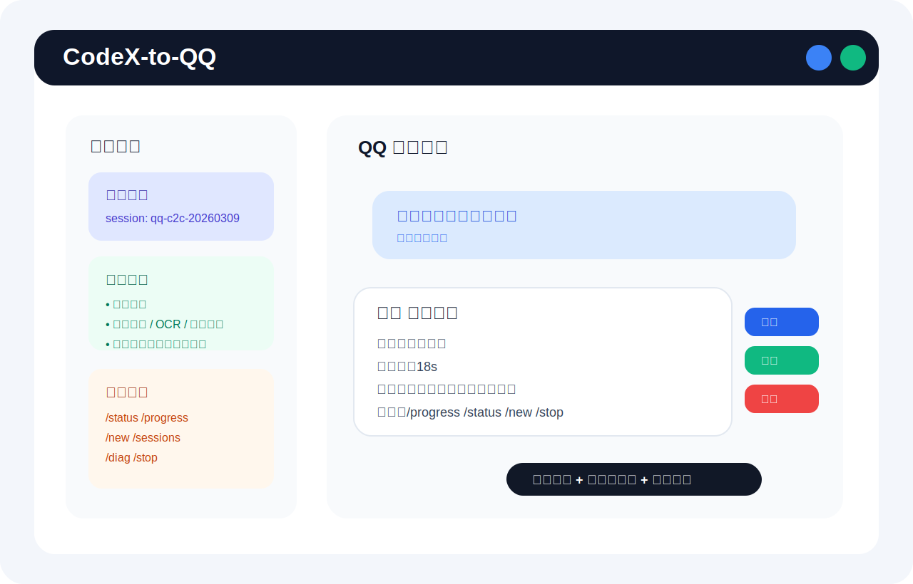
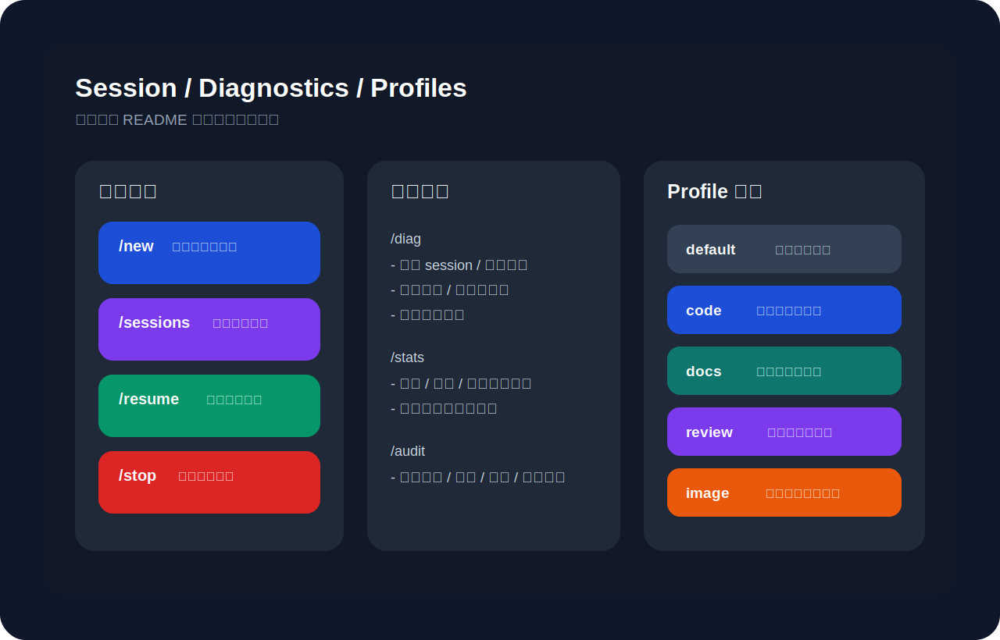

# CodeX-to-QQ

[](https://github.com/ankadada/CodeX-to-QQ/actions/workflows/ci.yml)
[](./LICENSE)
[](https://nodejs.org/)
[](https://github.com/ankadada/CodeX-to-QQ/releases)
[](./README.md#supported-platforms)

[中文说明](./README_CN.md) · [Security](./SECURITY.md) · [Troubleshooting](./docs/TROUBLESHOOTING.md) · [Contributing](./CONTRIBUTING.md) · [Changelog](./CHANGELOG.md)


Self-hosted `QQ -> Codex / Claude Code CLI` bridge for private chat and group `@bot` workflows.

It is designed for people who want to talk to Codex or Claude from QQ while keeping sessions, workspaces, long-running service behavior, and attachment handling under their own control.

## Highlights

- independent QQ bot credentials and `.env`
- QQ C2C and group `@bot` support
- per-peer, per-provider session and workspace isolation
- `/status`, `/progress`, `/queue`, `/retry`, `/stop`, `/new`, `/sessions`, `/rename`, `/pin`, `/fork`, `/workspace`, `/repo`, `/changed`, `/patch`, `/open`, `/export`, `/branch`, `/diff`, `/commit`, `/rollback`, `/diag`, `/version`, `/stats`, `/audit`
- progress updates, queueing, cancellation, and session recovery
- attachment download, provider-aware image handling, text extraction, and optional image OCR
- context compaction and retry-on-stale-session behavior
- quick-action keyboards for short control messages, plus numeric fallback menus and risky-command confirmations in plain-text QQ sessions
- launchd support on macOS and systemd user-service support on Linux

## Screenshots

### Chat UX



### Session / Diagnostics / Profiles



## Who this is for

Good fit:

- personal self-hosted use
- trusted small-team internal use
- power users who already run Codex CLI or Claude Code locally

Not a great fit without extra hardening:

- broad public multi-user deployments
- untrusted users with `dangerous` mode enabled
- hosts where downloaded attachments or generated file edits are unacceptable

## Safety Notes

This project can:

- execute Codex CLI or Claude Code tasks
- download attachments to local disk
- let the configured CLI read/write workspace files
- run in `dangerous` mode

If you are exposing it beyond yourself, read [`SECURITY.md`](SECURITY.md) first.

## Supported Platforms

- macOS: foreground run + `launchd`
- Linux: foreground run + `systemd --user`
- Windows: not officially supported yet

## Requirements

- Node.js `>=20`
- npm
- Codex CLI or Claude Code installed and available on `PATH` via `CODEX_BIN` / `CLAUDE_BIN`
- a dedicated QQ bot AppID / ClientSecret

## Quick Start

1. Copy config:

```bash
cp .env.example .env
```

The bundled `.env.example` includes every supported runtime knob with safe starter values.

If you want to use Claude Code, set `PROVIDER=claude`; otherwise the default stays on Codex.

2. Fill in your dedicated QQ bot credentials:

- `QQBOT_APP_ID`
- `QQBOT_CLIENT_SECRET`

3. Install dependencies:

```bash
npm install
```

4. Run checks:

```bash
npm run ci
npm run doctor
npm run doctor:json
```

5. Start in foreground:

```bash
npm start
```

6. Or install as a long-running service for the current OS:

```bash
npm run install:service
npm run service:status
```

7. Common service lifecycle commands:

```bash
npm run service:restart
npm run uninstall:service
```

## Long-Running Service

### macOS (`launchd`)

```bash
npm run install:launchd
npm run service:status:launchd
npm run service:restart:launchd
npm run uninstall:launchd
```

### Linux (`systemd --user`)

```bash
npm run install:systemd
npm run service:status:systemd
npm run service:restart:systemd
npm run uninstall:systemd
```

### Logs

Foreground / macOS:

```bash
npm run logs
```

Linux systemd:

```bash
journalctl --user -u codex-cli-qq.service -f
```

## Commands

- send a normal message: hand it to the active provider
- `/help`
- `/help quick`
- `/whoami`
- `/status`
- `/state`
- `/diag`
- `/doctor`
- `/version`
- `/stats`
- `/audit`
- `/session`
- `/sessions`
- `/rename <title>`
- `/pin [session_id|clear]`
- `/fork [source_session_id] [title]`
- `/history`
- `/new`
- `/start`
- `/files`
- `/workspace [show|recent|set <path|index>|reset]`
- `/repo [status|log|path]`
- `/changed`
- `/patch [file]`
- `/open <file>`
- `/export diff [working|staged|all]`
- `/branch [name]`
- `/diff [working|staged|all]`
- `/commit <message>`
- `/rollback [tracked|all]`
- `/progress`
- `/queue`
- `/cancel`
- `/stop`
- `/retry`
- `/reset`
- `/resume <session_id|clear>`
- `/confirm-action list`
- `/profile default|code|docs|review|image`
- `/mode safe`
- `/mode dangerous`
- `/model <name|default>`
- `/effort low|medium|high|default`

## Common Workflows

- **Quick start**
  - send `/help quick`
  - then send a normal message to let the active provider start working
- **Continue the last task**
  - just keep chatting
  - use `/retry` if you want to rerun the last executed request
- **Jump back to an older session**
  - send `/sessions`
  - reply with a number, or use `/resume <index|id>`
- **Switch to another project directory**
  - send `/workspace recent`
  - reply with a number, or use `/workspace set demo`
- **Inspect changes**
  - send `/changed`
  - then use `/diff`, `/open <file>`, or `/patch`
- **Risky operations**
  - commands like `/rollback all` or `/mode dangerous`
  - now require an explicit confirmation step; use `/confirm-action list` if the prompt scrolled away

## Recommended Defaults

- `QQBOT_ALLOW_FROM=*`: allow all direct-message senders only if you trust the host/user scope
- `QQBOT_ALLOW_GROUPS=`: leave empty for all groups, or set explicit allowlist values
- `QQBOT_ENABLE_GROUP=true`: enable group `@bot`
- `DEFAULT_MODE=dangerous`: convenient for personal-only trusted use
- `SHOW_REASONING=false`: avoid flooding QQ
- `DOWNLOAD_ATTACHMENTS=true`: let the active provider read downloaded files directly
- `EXTRACT_ATTACHMENT_TEXT=true`: improve “summarize this document” style prompts
- `MAX_GLOBAL_ACTIVE_RUNS=2`: avoid saturating the machine
- `COMPACT_CONTEXT_ON_THRESHOLD=true`: summarize before forcing a hard reset
- `SEND_ACK_ON_RECEIVE=true`: confirm receipt quickly
- `PROACTIVE_FINAL_REPLY_AFTER_MS=30000`: switch to proactive reply for slow tasks
- `AUTO_PROGRESS_PING_MS=15000`: periodic progress updates
- `MAX_AUTO_PROGRESS_PINGS=2`: cap periodic progress messages
- `PHASE_PROGRESS_NOTIFY=true`: send milestone progress updates in private chat
- `ENABLE_QUICK_ACTIONS=true`: attach quick-action keyboards to short control messages
- `QUICK_ACTION_RETRY_MS=21600000`: if QQ rejects custom keyboards for this peer, auto-downgrade to plain text and retry later
- `TEXT_SHORTCUT_TTL_MS=600000`: keep the plain-text numeric shortcut menu alive for a short time
- `PENDING_ACTION_TTL_MS=600000`: keep risky-command confirmation menus alive for a short time
- `RETRACT_PROGRESS_MESSAGES=false`: recommended; QQ visibly shows recall notices
- `DELIVERY_AUDIT_MAX=120`: keep recent delivery/run audit entries
- `QQ_API_TIMEOUT_MS=15000`: timeout for QQ API requests
- `QQ_DOWNLOAD_TIMEOUT_MS=30000`: timeout for attachment downloads
- `IMAGE_OCR_MODE=auto`: image OCR mode (`auto` / `on` / `off`); `auto` is biased toward screenshots / UI captures
- `MAX_IMAGE_OCR_CHARS_PER_FILE=1200`: max OCR text injected per image

## UX Notes

- private chat can proactively open a fresh session with `/new`
- `/sessions` + `/resume <id>` lets you jump back to older sessions
- `/rename`, `/pin`, `/fork` let you treat long-running provider sessions as reusable “work threads”
- `/queue` shows the active job plus pending backlog, and `/retry` replays the most recent executed prompt
- `/workspace set demo` quickly moves a peer to `WORKSPACE_ROOT/demo`, while absolute paths let you bind an existing local project
- `/workspace recent` lists recent paths and lets you switch by replying with a number
- every workspace is also a lightweight Git repo, so `/repo`, `/branch`, `/diff`, `/commit`, and `/rollback` work directly in chat
- `/changed`, `/patch`, `/open`, and `/export diff` make it easier to inspect and hand off actual workspace artifacts from QQ
- risky operations like `/rollback all` and switching to `dangerous` mode now require an explicit confirmation step
- if a confirmation prompt scrolls away, `/confirm-action list` brings it back and `/confirm-action latest confirm` handles the newest one directly
- quick-action keyboards now auto-downgrade per peer when QQ rejects custom keyboards, so logs stay quieter and replies still arrive
- `/help` now auto-switches to a shorter “QQ hand-typing menu” when the current peer is in text-only mode, with reply-by-number shortcuts; you can also jump straight to `/help quick`
- images can optionally contribute OCR text in addition to being passed as image input; `auto` mode is biased toward screenshots and UI error captures instead of ordinary photos
- quick-action keyboards are optimized for QQ mobile layout, but client rendering can still vary
- progress recall is disabled by default because QQ shows a visible “message recalled” notice

## Files and Data

Runtime-generated files are intentionally ignored by git:

- `.env`
- `logs/`
- `data/`
- `workspaces/`

Downloaded attachments are stored under:

```text
workspaces/<peer>/.attachments/<messageId>/
```

## FAQ

For common setup and runtime issues, see [`docs/TROUBLESHOOTING.md`](./docs/TROUBLESHOOTING.md).

### Why are some buttons not fully visible?

QQ client layouts vary by platform and viewport width. This project uses a mobile-friendlier multi-row layout, but QQ may still compress or hide parts of the keyboard depending on the client.

### Why is progress recall disabled by default?

Because QQ shows an explicit recall notice, which usually feels noisier than simply leaving the old progress message in place.

### Can I use `dangerous` mode?

Yes, but it is intended for trusted self-hosted use. Do not share a `dangerous` deployment with untrusted users.

### Why use a dedicated QQ bot?

To avoid credential confusion, isolate permissions, and reduce blast radius if you rotate or revoke secrets.

### Why does the project keep `data/` and `workspaces/` locally?

They store session state, audit history, downloaded attachments, and per-peer workspaces so the active provider can continue context-aware work across chats.

## Development

See [`CONTRIBUTING.md`](CONTRIBUTING.md).

## Security

See [`SECURITY.md`](SECURITY.md).

## Changelog

See [`CHANGELOG.md`](CHANGELOG.md).

## License

[MIT](LICENSE)
